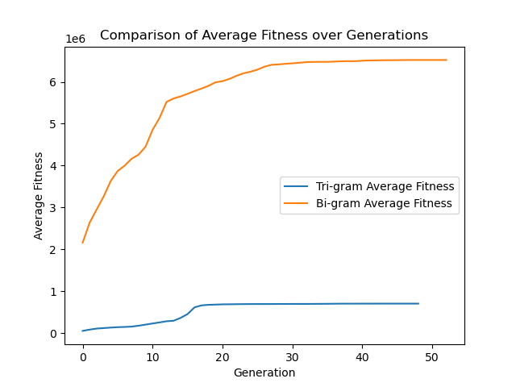

# 🔐 Substitution Cipher Decryption with Genetic Algorithms  

  
  

This project is a **Python application** that applies **Genetic Algorithms** to decrypt substitution ciphers.  
It provides a **Tkinter-based GUI** and uses **Matplotlib** for visualization.  

---

## 🚀 Features  
- Load encrypted ciphertext (`.txt`) and n-gram frequency files (`.csv`).  
- Decrypt using **Genetic Algorithm optimization**.  
- Compare **bi-gram** and **tri-gram** decryption performance.  
- Visualize fitness evolution (average & max) over generations.  
- Save decrypted text into `.txt` files.  

---

## 🛠️ Technologies Used  
- **Python 3**  
- **Tkinter** (GUI)  
- **Matplotlib** (Charts)  
- **CSV / File Handling**  

---

## 📷 GUI Preview  
Here is a preview of the application interface:  

  

